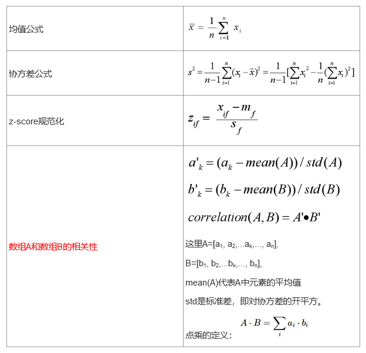
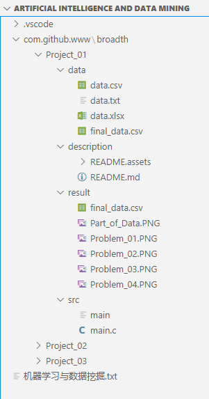

# 实验一：多源数据集成、清洗和统计

## 组员信息

**组长**：陈马杰

**组员分工信息**：

编程：陈马杰

查阅：郑成林、邓栋梁

文档：陈马杰

## 作业题目和内容

**题目**：《多源数据集成、清洗和统计》

**内容**：广州大学某班有同学100人，现要从两个数据源汇总学生数据。第一个数据源在数据库中，第二个数据源在txt文件中，两个数据源课程存在缺失、冗余和不一致性，请用C/C++/Java程序实现对两个数据源的一致性合并以及每个学生样本的数值量化。

- 数据库表：ID (int),  姓名(string), 家乡(string:限定为Beijing / Guangzhou / Shenzhen / Shanghai), 性别（string:boy/girl）、身高（float:单位是cm)）、课程1成绩（float）、课程2成绩（float）、...、课程10成绩(float)、体能测试成绩（string：bad/general/good/excellent）；其中课程1-课程5为百分制，课程6-课程10为十分制。
- txt文件：ID(string：6位学号)，性别（string:male/female）、身高（string:单位是m)）、课程1成绩（string）、课程2成绩（string）、...、课程10成绩(string)、体能测试成绩（string：差/一般/良好/优秀）；其中课程1-课程5为百分制，课程6-课程10为十分制。

**参考**：

数据库中Stu表数据

| ID   | Name | City     | Gender | Height | C1   | ...  | C10  | Constitution |
| ---- | ---- | -------- | ------ | ------ | ---- | ---- | ---- | ------------ |
| 1    | Sun  | Beijing  | boy    | 160    | 87   |      | 9    | good         |
| 2    | Zhu  | Shenzhen | girl   | 177    | 66   |      | 8    | excellent    |
| ...  | ...  | ...      | ...    | ...    | ...  | ...  | ...  | ...          |

student.txt中

ID Name City Gender Height C1 。。。 C10 Constitution202001 Sun Beijing male 180 87 。。。 9 good202003 Tang Hanghai male 156 91 。。。 10 general ... ... ... .. ... .. ... ... ...

两个数据源合并后读入内存，并统计：

1. 学生中家乡在Beijing的所有课程的平均成绩。
2. 学生中家乡在广州，课程1在80分以上，且课程9在9分以上的男同学的数量。(备注：该处做了修正，课程10数据为空，更改为课程9)
3. 比较广州和上海两地女生的平均体能测试成绩，哪个地区的更强些？
4. 学习成绩和体能测试成绩，两者的相关性是多少？（九门课的成绩分别与体能成绩计算相关性）

**提示**：

参考数据结构：

Student{

​        int id;

​        string id;

​        vector&#60;float&#62; data;

}

可能用到的公式：



**注意**：计算部分不能调用库函数；画图/可视化显示可以用可视化API或工具实现。

## 作业环境

**文件说明**：



**函数说明**：

```c
/* 函数声明 */
void init(PSTUDENT_INFO psiArray, int iLength);
PSTUDENT_INFO read_file_csv(const char file_name[]);
PSTUDENT_INFO read_file_txt(const char file_name[]);
PSTUDENT_INFO combination(PSTUDENT_INFO psiArrayOne, int iLengthOne, PSTUDENT_INFO psiArrayTwo, int iLengthTwo);
void print(PSTUDENT_INFO psiArray, int iRow);
void save_file_csv(PSTUDENT_INFO psiArray, int iRow);

// 声明解决设置问题的函数
void print_beijing_average_score(PSTUDENT_INFO psiArray, int iRow);
int count_guangzhou_score_number(PSTUDENT_INFO psiArray, int iRow);
void print_constitution_compare_between_the_girl_of_guangzhou_and_shanghai(PSTUDENT_INFO psiArray, int iRow);
void correlation_calculation(PSTUDENT_INFO psiArray, int iRow);
```

**调用说明**：

```c
/* 标准库 stdio.h */
FILE *fopen(const char *filename, const char *mode);
int fclose(FILE *stream);
int fgetpos(FILE *stream, fpos_t *pos);
int fsetpos(FILE *stream, const fpos_t *pos);
int fscanf(FILE *stream, const char *format, ...);
int fprintf(FILE *stream, const char *format, ...);
int fgetc(FILE *stream);
int printf(const char *format, ...);

/* 标准库 stdlib.h */
void *malloc(size_t size);
void free(void *ptr);
void exit(int status);
int system(const char *command);

/* 标准库 string.h */
void *memcpy(void *str1, const void *str2, size_t n);
void *memset(void *str, int c, size_t n);
int strncmp(const char *str1, const char *str2, size_t n);
char *strncpy(char *dest, const char *src, size_t n);
    
/* 标准库 math.h */
double pow(double x, double y);
double sqrt(double x)
```

**涉及技术**：

1、均值计算

2、标准差计算

3、两个数组的相关系数计算

4、文件读写

5、数据对比

## 难题与解决

**难题**：无

**解决**：无

## 总结

标准库是十分有用的，对标准库的熟悉程度会直接影响你对问题难度的直观感受。