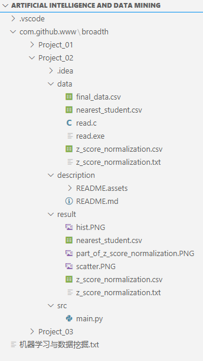

# 实验二：数据统计和可视化

## 组员信息

**组长**：陈马杰

**组员分工信息**：

编程：陈马杰

查阅：郑成林、邓栋梁

文档：陈马杰

## 作业题目和内容

**题目**：《数据统计和可视化》

**内容**：基于实验一中清洗后的数据练习统计和视化操作，100个同学（样本），每个同学有11门课程的成绩（11维的向量）；那么构成了一个100x11的数据矩阵。以你擅长的语言C/C++/Java/Python/Matlab，编程计算：

1. 请以课程1成绩为x轴，体能成绩为y轴，画出散点图。
2. 以5分为间隔，画出课程1的成绩直方图。
3. 对每门成绩进行z-score归一化，得到归一化的数据矩阵。
4. 计算出100x100的相关矩阵，并可视化出混淆矩阵。（为避免歧义，这里“协相关矩阵”进一步细化更正为100x100的相关矩阵，100为学生样本数目，视实际情况而定）
5. 根据相关矩阵，找到距离每个样本最近的三个样本，得到100x3的矩阵（每一行为对应三个样本的ID）输出到txt文件中，以\t,\n间隔。

**提示：**

计算部分不能调用库函数；画图/可视化显示可可视化工具或API实现。

## 作业环境

**文件说明**：



**函数说明**：

```python
def read_file_csv(file_name)
def draw_scatter_plot(list_score_data)
def draw_hist_plot(list_score_data)
def z_score_normalization(list_score_data)
def save_z_score_normalization_data(list_z_score_data)
def calculate_the_correlation_coefficient_matrix(file_name)
def visualize_the_confusion_matrix(list_z_score_data)
def calculate_and_save_three_nearest_student(list_correlation_coefficient)
```

**调用说明**：

```python
# 模块 pandas
read_csv()
tolist()

# 模块 numpy
mat()
transpose()
array()

# 模块 csv
writer()

# 模块 math

# 模块 matplotlib.pyplot
figure()
add_subplot()
set_title()
set_xlabel()
set_ylabel()
scatter()
hist()
colorbar()
xticks()
show()

# 模块 sklearn.metrics.confusion_matrix
```

**涉及技术**：

1、均值计算

2、标准差计算

3、数组的相关系数计算

4、z-score归一化

5、非数值类型量化

6、文件读写

7、绘图

## 难题与解决

**难题**：无

**解决**：无

## 总结

Python 的库实在太多了，在限制不能使用很多别人写好的计算包的时候，Python就变得不想Python了。