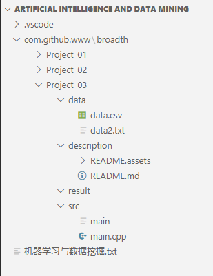

# 实验三：k-means 聚类算法

## 组员信息

**组长**：陈马杰

**组员分工信息**：

编程：郑成林

查阅：陈马杰、邓栋梁

文档：陈马杰

## 作业题目和内容

**题目**：《k-means聚类算法》

**内容**：用C++实现k-means聚类算法，

1. 对实验二中的z-score归一化的成绩数据进行测试，观察聚类为2类，3类，4类，5类的结果，观察得出什么结论？
2. 由老师给出测试数据，进行测试，并画出可视化出散点图，类中心，类半径，并分析聚为几类合适。

样例数据(x,y)数据对：

| 3.45 | 7.08 |
| ---- | ---- |
| 1.76 | 7.24 |
| 4.29 | 9.55 |
| 3.35 | 6.65 |
| 3.17 | 6.41 |
| 3.68 | 5.99 |
| 2.11 | 4.08 |
| 2.58 | 7.10 |
| 3.45 | 7.88 |
| 6.17 | 5.40 |
| 4.20 | 6.46 |
| 5.87 | 3.87 |
| 5.47 | 2.21 |
| 5.97 | 3.62 |
| 6.24 | 3.06 |
| 6.89 | 2.41 |
| 5.38 | 2.32 |
| 5.13 | 2.73 |
| 7.26 | 4.19 |
| 6.32 | 3.62 |

找到聚类中心后，判断(2,6)是属于哪一类？

**注意**：

除文件读取外，不能使用C++基础库以外的API和库函数。

## 作业环境

**文件说明**：

**函数说明**：

**调用说明**：

**涉及技术**：

## 难题与解决

**难题**：

**解决**：

## 总结
